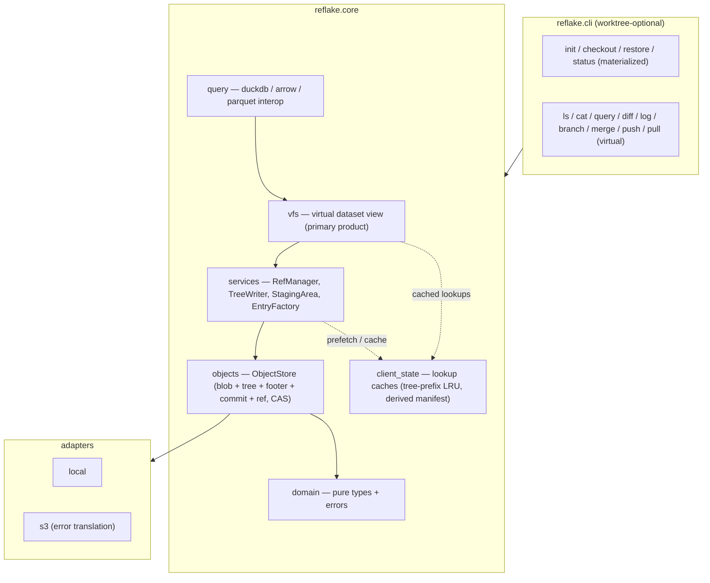
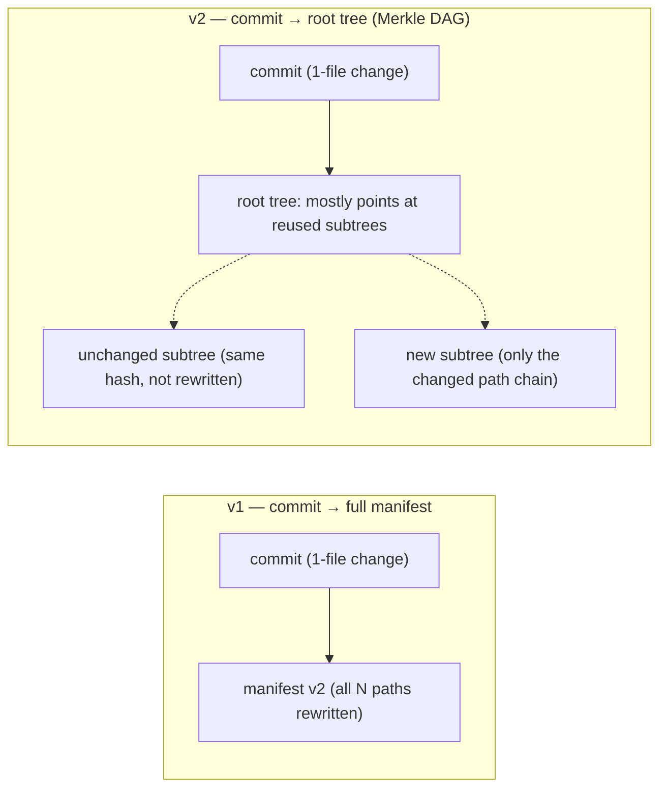
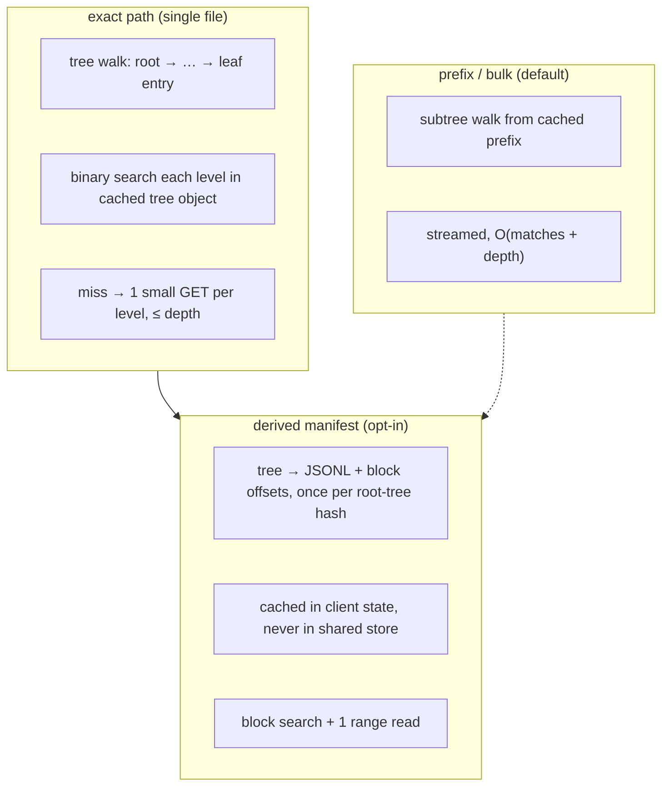

# Reflake Architecture v2 — Design Sketch

**Status:** proposal (rev. 3 — rev. 2 folded in review: lookup-path design with a client-side tree cache,
parquet-footer scoping, conflict-retry in P0, restore/checkout materialization, `generation`
semantics; rev. 3 ships the two remaining rollout items — the `repository_store/` + `storage/`
→ `objects/` store unification (§1/§12) and the footer-stats query pruning engine (§4)).
**Post-review hardening (2026-08):** ancestry checks (`is_ancestor`, fast-forward pre-checks,
merge-base, push/pull collection) now traverse the full parent DAG instead of first-parent
chains; the staged overlay merges sorted streams so `commit --staged` is order-safe;
`ObjectStore` covers enumeration/deletion/paths so gc and sync are protocol-typed; local
commits/refs/config writes are atomic.
**Structural refactor (2026-08):** `ObjectStore` is split into composable capabilities
(`ObjectIO`, `RefCas`, `TreeQuery`, `StoreInventory`) with consumers annotated against the
narrow view they need; one key-space mapping (`layout.object_relative_key`) now defines
physical locations for both adapters; client branch snapshots moved out of `refs/heads/`
into `state/branch-snapshots/` (§5's filename-coupling fix); a canonical
`merge_sorted_streams` helper owns the sorted-stream invariant used by staged overlays;
leaf serialization/validation is unified in `core/entry_codec.py` and `ManifestEntry`
derives `identity_value`/`blob_hash` instead of storing redundant copies; the module-level
repository facade functions are gone — the Python API is `open_repository()` +
`ReflakeRepository` methods.
**P0 shipped:** tree objects (`core/objects/tree.py`), tree-walk lookups with a client-side
prefix cache (`core/objects/query.py`), `TreeWriter` (`core/services/tree.py`), `commit → tree`
with `{tree, parents}`, staged-overlay commits with CAS retry, derived manifests
(`export_derived_manifest`), `.idx`/embedded-index removal, and S3 lock removal.

**P1 shipped:** `filesystem.py` → `core/vfs/`; `index.py` → `core/query/` (DuckDB catalog
absorbs the old analytical index and gains a `footer` column); parquet footer capture
(`core/objects/footer.py`, opt-in `config set parquet_footer true`) producing `bp`/`mp` tree
entries with `footers/<hash>` stats objects; worktree-optional CLI (`list`/`cat`/`diff`/`log`/
`query` on S3 URIs without a local worktree).

**P2 shipped:** plan-then-batch transfers (transfer plan + s5cmd batch or per-object boto3
execution, progress callbacks, footer sync); adapter error translation (`ObjectMissingError`/
`PreconditionFailedError`/`StorageUnavailableError` at the S3 boundary, CLI no longer handles
botocore exceptions); `reflake gc` audit with opt-in `--prune`.

**P3 shipped:** metadata-only 3-way merge for diverged branches (LCA + streaming
base/ours/theirs merge, merge commits with two parents, `MergeConflictError` on conflicting
paths); per-branch reflog (`reflake reflog`); dataset registry (`reflake catalog`).
**Post-rollout shipped (rev. 3):** the `repository_store/` + `storage/` → `objects/` store
unification (§12 — one `ObjectStore` protocol; `LocalObjectStore` / `S3ObjectStore`
adapters) and the query pruning engine over footer stats (§4 — `core/query/pruning.py` +
`reflake query prune`, row-group selection from stats objects only).  Open questions
remain in §15 (bucket layout, `export` first-class, tree-prefix pin policy, remote
row-group stats on `mp` entries).
**Assumption:** **no backwards compatibility** with v1 on-disk formats, commit schema,
manifest format, ref format, staging format, lock format, or module layout. We can break
the on-disk contract freely.

This document sketches the full set of architectural changes to make Reflake an
object-first **data** versioning engine rather than a git-clone-with-S3. Each section ties
back to the current code so it is actionable.

---

## 0. What "no backcompat" unlocks

v1 carries several choices that only exist for historical continuity. Without the
constraint we can:

- Replace per-commit full manifests with **Merkle trees** (the big one, §2).
- **Delete the `.idx` sidecar + embedded-index dual representation** entirely (§3).
- Change commit/ref/staging/lock serialization freely, e.g. `parents: []` for future merges (§9).
- **Drop the S3 branch-lock machinery** and rely on pure CAS (§6).
- Rename/reorganize modules and protocol surfaces without shims (§12).
- Change the CLI surface without keeping legacy flags (§4).

---

## 1. Target architecture



Module map (no backcompat ⇒ free renames):

```
src/reflake/
  core/
    domain/          # types + errors (keep)
    objects/         # ObjectStore: blob + tree + footer + commit + ref IO, CAS; local/s3 adapters
                     #   [merged storage/ + repository_store/, rev. 3]
    vfs/             # virtual dataset view (was filesystem.py) — primary product
    query/           # duckdb / arrow / parquet interop (new; absorbs core/index.py)
    services/        # RefManager, TreeWriter (was SnapshotWriter), StagingArea, EntryFactory
    client_state.py  # + lookup caches: tree-prefix LRU, optional derived-manifest cache
    config.py, hashing.py, layout.py
  cli.py
```

- `RepositoryStore` protocol → a single `ObjectStore` protocol (index and lock concerns are gone).
- `SnapshotWriter` → `TreeWriter` (writes trees + commits, not manifests).
- Lookups have one core path (tree walk with cached prefixes) plus one optional
  materialization (derived manifest) — §3.

---

## 2. Data model: Merkle trees over full snapshots

### 2.1 The problem in v1

Every commit materializes a **full JSONL manifest of every path**. Even a 1-file staged
change merges and rewrites the whole manifest (`_merge_sorted_entry_streams` +
`ManifestWriter`); `verify`, `restore`, and prefix `mv`/`rm` all rewrite the full manifest.
Fine at 100k entries, a scaling wall at 100M.



### 2.2 Objects

- **blob** — content bytes, keyed by blake3. Layout unchanged (`<hash[:2]>/<hash[2:]>`).
- **tree** — sorted entries `(name, kind, hash)`; `kind` ∈ {t, b, m, bp, mp}. Addressable
  by blake3 of its serialized form; stored under `trees/` (or unified `objects/`, §15).
  **Bounded fanout**: a tree object holds at most ~10k entries (≈1 MB). A directory whose
  entry count exceeds the bound splits into **name-range shard subtrees** (a `t` entry
  covering a contiguous name slice of the same directory). This preserves v1's
  block-index property for flat directories: 1M files in one directory → a small top node
  of ~100 shard pointers + one shard fetch, depth 2–3.
- **footer** — compact parquet stats object (§4): schema hash + per-row-group column
  min/max/nulls. Referenced from `bp`/`mp` tree entries. Small, content-addressed,
  cacheable.
- **commit** — `{ tree, parents: [...], message, created_at, branch, generation }`, with
  `generation = 1 + max(parent generations)` (1 for a root commit).
- **ref** — branch → commit id, updated via version-token CAS (unchanged).

Serialization sketch (keeps today's compact line style — tree lines are the current
manifest lines, relabeled):

```
# tree object (one entry per line, sorted by name)
["t", name, hash]                              # subtree (directory or name-range shard)
["b", name, hash, size, mtime_ns]              # blob-backed file
["m", name, hash, size, mtime_ns, source_uri]  # source pointer (unverifiable)
["bp", name, hash, size, mtime_ns, footer]     # parquet, blob-backed, + footer stats
["mp", name, hash, size, mtime_ns, source_uri, footer]  # parquet, source pointer, + footer stats
```

Entry validation on read stays — the v1 `ManifestEntry` validation contract survives as
tree-entry validation (`test_mandatory_validation` is ported, not deleted).

### 2.3 What each operation becomes

| Op | v1 | v2 |
|---|---|---|
| `commit` (full walk) | full manifest rewrite, O(N) | build trees bottom-up; metadata write O(changes); unchanged subtrees reused by hash |
| `commit --staged` / `add` | merge into full manifest | overlay-tree merge into parent tree, O(changes) |
| `diff a b` | two full-manifest walks | parallel tree walk; identical subtrees skipped by hash compare |
| `list` | manifest + `.idx` | streamed tree walk (§3) |
| `verify` | full manifest rewrite | promote `m`/`mp`→`b`/`bp`; only affected subtrees rewritten |
| `mv` / `rm` (prefix) | full manifest rewrite | rewrite only the affected subtree(s) |
| `import` | full manifest merge | same as staged-add tree merge |
| `sync` | per-object copies of all reachable blobs | reachable set computed by tree walk (§7) |

---

## 3. Lookups: one core path, one optional materialization

Lookup performance is a first-class requirement, not an afterthought. Three access
patterns, one design:



- **Exact-path lookup (default): tree walk with a client-side prefix cache.** Client state
  keeps an LRU cache of tree objects keyed by content hash — content-addressed, so the
  cache is **never stale** (same argument that made the v1 derived-manifest cache safe).
  Upper levels (root + first level) are pinned for hot repos. A lookup splits the path,
  binary-searches each level's entries in the (cached or fetched) tree object, and fetches
  only what's missing: **0–1 GET warm**, ≤ depth GETs cold. Tree objects are ≤1 MB and
  fetched whole per level — no range-read machinery inside a tree.
- **Prefix / bulk listing (the primary bulk path): subtree walk.** Fetch the subtree at
  the prefix, stream entries. O(matches + depth), no index, no materialization. This is
  what `ls`, prefix `diff`, and `query` scans use. Bulk access is the normal access
  pattern; per-file exact lookups ride the same cached prefixes.
- **Derived manifest (optional, per client):** materialize tree → JSONL manifest with
  block offsets once per root-tree hash; cache in client state; **never written to the
  shared store**. Gives v1-class point lookups (block binary search + 1 range read) for
  latency-critical clients and for `export`. Built lazily; invalidated never (keyed by
  root-tree hash).
- **Targets** (to lock into the scale bench — `bench.txt` — not measurements):
  - exact-path, warm: **< 20 ms** (S3), **< 1 ms** local FS — 0–1 GET.
  - exact-path, cold worst: bounded by depth × small GET; **≤ ~200 ms** only when every
    level misses, typically 1–2 GETs. Depth is ≤ 4–5 at 100M entries (path depth +
    shard splits at 10k fanout).
  - prefix listing: O(matches + depth) — 200 files < 50 ms cold, 10k files < 300 ms cold.
  - derived-manifest point lookup: **< 10 ms**.

This deletes: `ManifestIndexStore`, `manifest_query` dual paths, `_cached_manifest_index_path`,
`build_manifest_index_file`, the index/fallback decision tree, and `ManifestWriter.build_index`
plumbing. One lookup core + one optional materialization instead of three paths.

---

## 4. Virtual dataset view + query = the primary product

- A branch/commit **is** a virtual dataset: `reflake://<dataset>@<ref>/<path>` with a staged
  overlay (`+staged`). Read-only fsspec already exists; make it the center of the product
  instead of the working tree.
- **`reflake.core.query`** absorbs the existing `core/index.py` (`build_analytical_index`,
  `query_analytical_index`): manifest/tree → DuckDB table (`path, hash, size, mtime_ns, …`)
  with optional parquet export. The catalog becomes derivable from tree + footer objects
  without re-reading footers.
  - DuckDB over `reflake://` (via fsspec/duckdb path, or a branch-scoped table function)
    with predicate pushdown.
  - **Parquet footer metadata**: at ingest, read only the footer (`head_object` + last
    bytes), write a compact stats object — **schema hash + per-row-group column
    min/max/nulls**, not the full footer — and reference it from the `bp`/`mp` tree entry.
    `SELECT … WHERE col = x` prunes row groups from the stats **without reading object
    bytes**. This is the single biggest data-specific differentiator, and it stays
    metadata-only. Footer capture is opt-in at ingest (cost: one footer read per file);
    entries carry a `has_footer` marker so `verify` can backfill it later.
    **Shipped (rev. 3):** the pruning engine lives in `core/query/pruning.py`
    (`parse_where_clause`, `prune_row_groups`, `plan_pruned_scan`) and is exposed as
    `reflake query prune <ref> <path> --where "col >= x"` — it reads only the
    `footers/<hash>` stats objects and reports the row groups that may match, with
    conservative keep-on-unknown handling. Predicates are AND-composed `= != < <= > >=
    IS NULL IS NOT NULL`; OR is rejected.
- **Restore / checkout (materialization from trees):** walk the path chain to the requested
  paths, read only the needed blobs (or source URIs), write to the working tree. No full
  materialization for virtual ops.
- **CLI splits into worktree-required vs virtual**: `init/checkout/restore/status` need a
  working tree; `ls/cat/query/diff/log/branch/merge/push/pull` work on virtual refs with no
  materialization.
- The working tree remains an optional local optimization (dev/testing/small datasets), not
  the model's center.

---

## 5. Staging as an overlay tree

v1: staging is a branch-keyed JSON file of add/remove changes in client state, with branch
names used as raw filenames (`client_state.stage_path(branch)` → `{branch}.json`).

v2 (format change is free):
- Staged state = a small typed **overlay tree delta**: `{ added: path → entry, removed: [prefix…] }`,
  versioned, stored per-client (keyed by a hashed branch key, fixing the filename coupling).
- `commit --staged` = tree-merge the overlay into the parent, O(changes) — and see §6 for
  the conflict-retry contract that makes this safe without locks.

---

## 6. Concurrency: CAS only — drop locks

- Keep `compare_and_set_branch_ref` (version-token CAS) as the **only** safety primitive.
- Remove S3 branch-lock objects (`locks/refs/heads/*`) and the `lock list` / `lock cleanup`
  surface, or demote them to optional diagnostics. Expiry-based locks are not load-bearing
  (clock skew / long operations), and with no backcompat there's no reason to keep them in
  the core path.
- **Conflict retry is a P0 contract, not a later feature.** Dropping locks means the
  two-stage `add → commit` flow (especially long S3 imports) can hit `RefConflictError`
  when a peer advanced. With trees this is cheap and automatic: `commit --staged`
  re-applies the overlay onto the new parent (O(changes)) and retries the CAS; after N
  attempts it surfaces the conflict with both commit ids. The retry loop is part of the
  P0 tree-merge implementation, not the P3 3-way-merge work.
- `RefStore` shrinks to pure CAS.

---

## 7. Sync: plan-then-batch, one transfer path

v1: per-object `_copy_blob` loops; `generate_transfer_commands` is a separate divergent path;
`write_blob_stream` only recently wired to the transfer backend.

v2:
1. From the tree + commit DAG, compute the exact **missing-object set** on the destination
   (commits, trees, footers, blobs, refs) via existence checks.
2. Execute in one batch through `BlobTransferBackend` (s5cmd `--if-not-exists` manifest file,
   or parallel boto3 multipart), with a progress callback.
3. CAS the ref last.

`generate_transfer_commands` merges into this: one "transfer plan" concept — a list of
(src → dst) copies that can be printed or executed.

---

## 8. Errors at the adapter boundary

- All `botocore`/`ClientError` handling moves into the S3 adapter, which raises domain errors
  (`ObjectMissingError`, `PreconditionFailedError`, `StorageUnavailableError` — subclasses of
  `ReflakeError`).
- `cli.py` drops `BotoCoreError`/`ClientError` from its handled-errors list; one
  `ReflakeError`-based list remains.

---

## 9. Merge semantics: design now, cheap later

- Commit object uses `parents: list[str]` (not `parent: str | None`); `generation =
  1 + max(parent generations)`. Trivial change now, unlocks 3-way metadata merge later.
- MVP stays fast-forward-only. With trees, a metadata-only 3-way merge is tractable:
  compare subtrees, auto-merge non-conflicting subtrees, conflict = differing leaf
  blob/footer hashes. That's the natural collaboration story for data (lakeFS/Dolt-style).

---

## 10. Identity modes

- Keep `blake3` (default) and `meta` (opt-in; unverifiable until `verify`).
- Rename `meta` → `source` (it stores a source pointer) and add an explicit `unverifiable`
  flag so tooling can surface it. Free now.
- New mode: **parquet-footer identity** — for parquet inputs, identity = hash of the
  compact footer stats object + schema, with **no blob read**; entries are `mp` (source
  pointer) unless a blob is also stored. Pruning works off the footer; fetching row
  groups reads the source. This is the `verify`-able fast path for parquet workloads.

---

## 11. Retention / GC stance

- No GC by default; immutable objects accumulate by design (document as a feature).
- Add `reflake gc --dry-run` (audit-only by default): compute reachable objects from all
  refs (a cheap tree walk now — blobs, trees, footers, commits) and report orphans.
  `--prune` stays optional and opt-in.

---

## 12. Naming / module reorganization

Covered in §1. Summary of renames:

| Now | v2 |
|---|---|
| `repository_store/RepositoryStore` | `objects/ObjectStore` — done (rev. 3) |
| `repository_store/base.py` (`ObjectStore/RefStore/ManifestIndexStore/ManifestQuerier`) | `objects/base.py` (`ObjectStore`) — done (rev. 3) |
| `storage/` + `repository_store/` | `objects/` (one protocol, two adapters) — done (rev. 3) |
| `filesystem.py` | `vfs/` |
| `services/snapshot.py::SnapshotWriter` | `services/tree.py::TreeWriter` |
| `index.py` (duckdb analytical index) | absorbed into `query/` |
| `manifest_index.py` | removed (§3) |
| `manifest.py` | tree entry serialization + derived-manifest export |

---

## 13. What we keep (do not change)

- Content-addressed blobs, blake3, `<hash[:2]>/<hash[2:]>` layout.
- CAS ref updates + `RefConflictError`.
- Compact line-based JSONL serialization style (tree entries reuse the same shape).
- Metadata-first guardrails: no blob reads for `diff`/`list`/`log`/`status` — footer
  stats count as metadata.
- Client-first/serverless: no daemon, no central database. Lookup caches are per-client
  and content-addressed (never stale, never shared).
- The services decomposition (`RefManager`, `StagingArea`, `EntryFactory` + new `TreeWriter`).
- `verify` / promotion model (source → blob-backed).
- Entry validation on read (tree entries validate exactly like manifest entries do today).

---

## 14. Phased rollout

- **P0 — Tree model + lookups.** Biggest structural change: `objects/` store, tree
  building with bounded fanout, `commit → tree`, **client-state tree-prefix cache**,
  **derived-manifest export** (shipped early so streaming consumers — `diff`, `log`,
  `status` — have one place to regress-test while ops port), port all ops, delete
  `.idx` + embedded index, drop locks, **`commit --staged` conflict-retry loop**.
  Everything else builds on this.
- **P1 — Virtual-first.** `vfs` + `query` (absorbs `index.py`; duckdb; parquet footer
  ingest), overlay staging, worktree-optional CLI.
- **P2 — Sync & robustness.** Plan-then-batch transfers, adapter error translation,
  retention/GC audit.
- **P3 — Collaboration.** 3-way metadata merge, dataset catalog/registry, reflog.

---

## 15. Open questions

- Bucket layout: keep `blobs/`, `commits/`, `trees/`, `refs/`, or unify under `objects/`
  with type prefixes (`objects/b/…`, `objects/t/…`)?
- Keep full-manifest export first-class (`reflake export <ref>`), or is tree walk + vfs
  enough?
- Parquet footer ingestion: always capture, or opt-in flag? (cost: `head_object` + footer
  read per file at ingest; entries keep a `has_footer` marker so `verify` can backfill.)
- Should `mp` entries optionally carry remote row-group stats so distributed parquet can
  prune without any local read?
- Tree-prefix cache policy: pin root + first level always, LRU below — or make pinning
  configurable per repo size?
